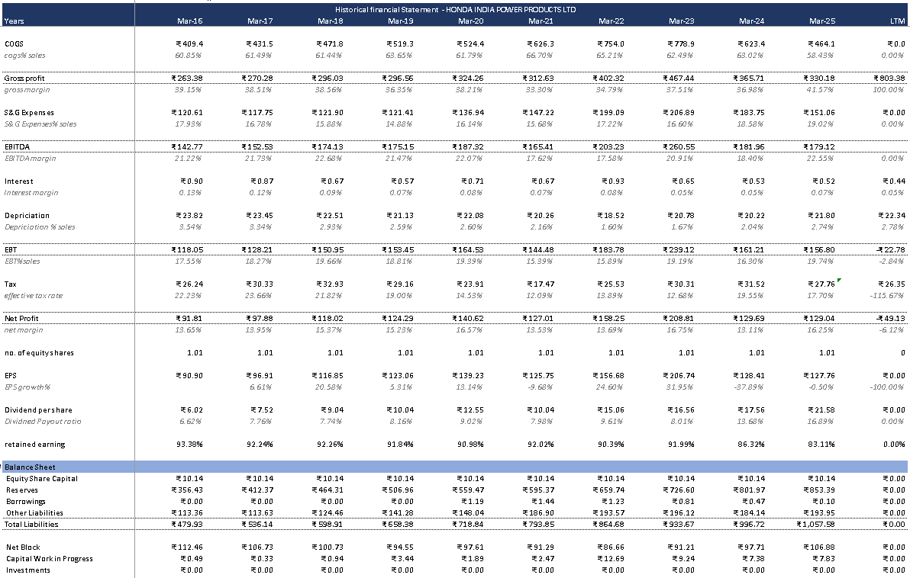
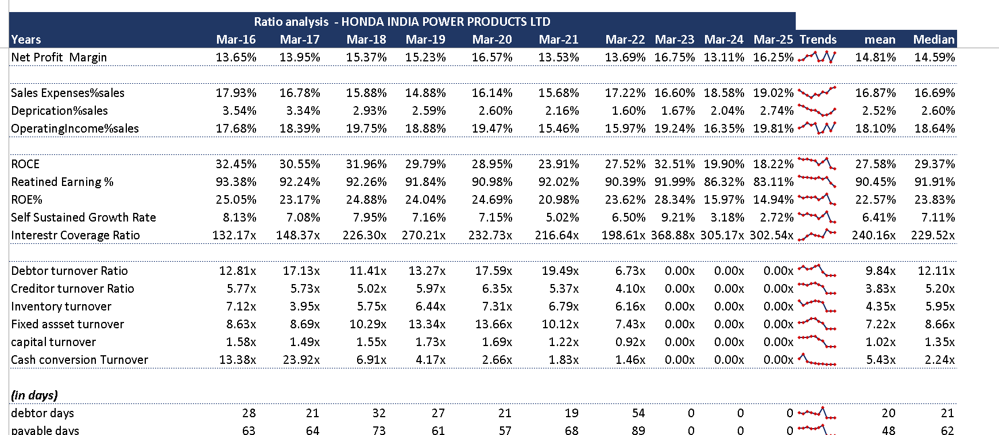
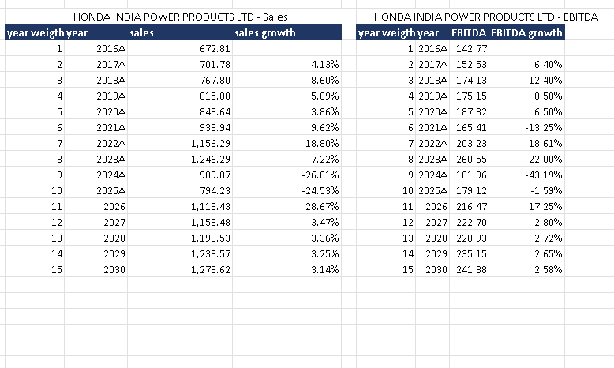

Just out of curiosity.....

This project is a financial analysis of Honda India Power Products Ltd. using Microsoft Excel.

I used the company's historical financial data to understand how the business has performed over the years and to study its profitability, growth, efficiency and cash flow trends.

## What I worked on

* Historical revenue and profit analysis
* EBITDA, EBIT and net profit margins
* Sales and earnings growth
* ROE and ROCE
* Working capital analysis
* Turnover ratios
* Cash flow analysis
* Historical trend comparison
* Basic Sales and EBITDA forecasting up to 2030

## Historical Financial Analysis

The workbook contains historical financial statement data and calculations used to study changes in revenue, costs, profitability and earnings over time.

## Ratio Analysis

I calculated and compared different financial ratios to understand profitability, returns and operating efficiency.

## Forecasting

I also created a basic forecast for Sales and EBITDA up to 2030 based on historical trends.

## Tool Used

* Microsoft Excel

## Excel File

The complete model is available in:

`Honda_Financial_Analysis.xlsx`

## Future Work

I plan to improve this project by adding:

* Assumption-based forecasting
* Detailed three-statement projections
* DCF valuation
* Sensitivity analysis

This project is mainly for learning and portfolio purposes.
